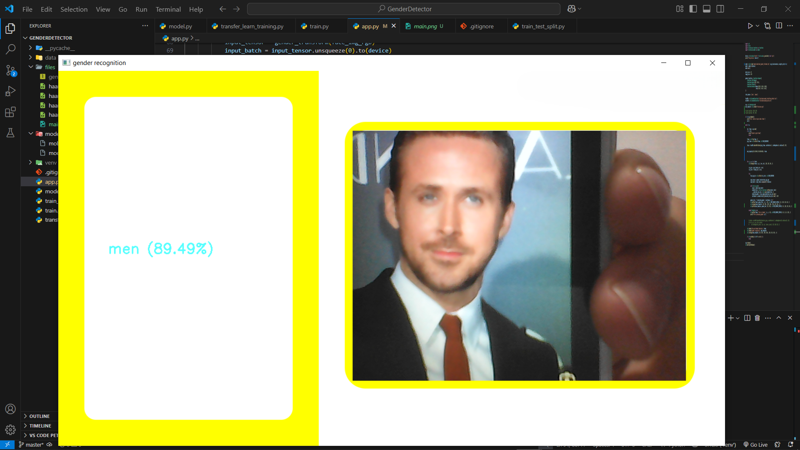
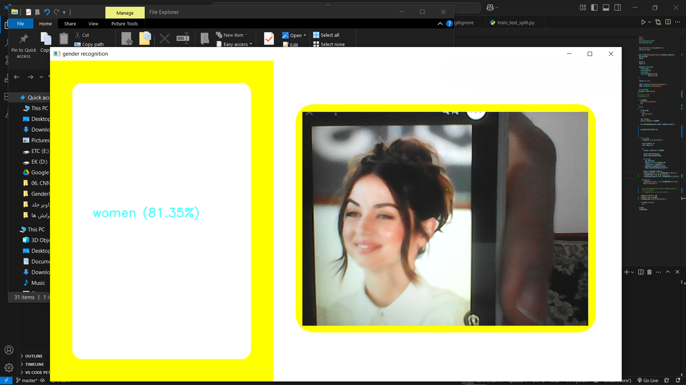

# Gender Detecion

[](https://github.com/Ehsan-004/TinyUrler)
[](https://github.com/Ehsan-004/TinyUrler/blob/main/LICENSE)
[](https://github.com/Ehsan-004)

</br>

## A fine-tuned version of Mobilenet to detect gender 



## 📝 Description

It is my first experiment to perform Transfer Learning as I just got familiar with it.<br>
I used mobilenet model and changed its last fully connected layer to my costum layer which has just two outputs nodes corresponding to man and woman.


## ⚙️ Installation

To set up, follow the installation instructions:


1.  **Clone the repository:**

    ```bash
    git clone https://github.com/Ehsan-004/GenderDetection
    cd GenderDetection
    ```

2.  **Create a virtual environment:**

    ```bash
    python -m venv venv
    venv\Scripts\activate
    ```

3.  **Install dependencies:**

    ```bash
    pip install -r requirements.txt
    ```
   
4.  **Run app.py:**
    ```bash
    python app.py
    ```


## Model Architecture:

```
# last layer
Sequential(
  (0): Dropout(p=0.2, inplace=False)
  (1): Linear(in_features=1280, out_features=2, bias=True)  # 2 => man and woman
)
```

## 🧑‍💻 Developer

- [Ehsan-004](https://github.com/Ehsan-004)

## 📜 License

This project is open-source and does not have a specific license. Feel free to use, modify, and distribute it as you see fit.